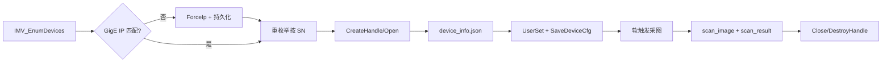

# IMV Scanner Calibration Tool

工厂标定数据采集工具，基于 **华睿 IMV MVSDK** 连接扫码器/工业相机，导出配置、软触发采图，并保存设备信息与结果文件。

## 功能概述

一次完整采集会依次完成：

1. 通过 **IMV SDK** 枚举并连接指定设备（序列号或 IP）
2. **GigE 工厂网段**：若设备 IP 不是 `192.168.40.200`，连接前自动改为该地址并持久化（网关 `192.168.40.1`，子网 `255.255.255.0`）
3. 保存 `device_info.json`（型号、SN、IP、MAC、`ip_before` / `ip_after` / `ip_reconfigured` 等）
4. 读取并 `UserSetLoad` 当前配置组，再切换目标 UserSet 导出 `software_config.xml` / `hardware_config.xml`（见 `userset_info.json`）
5. 软触发采集一帧，保存图像与 `scan_result.json`（解码状态、条码内容等）

可选：`--dump-features` 导出可读 GenICam 特征摘要，用于调试不同机型的特征名差异。

## 环境要求

| 项目 | 说明 |
|------|------|
| 操作系统 | **Windows / Linux**（MVSDK 不支持 macOS） |
| Python | 3.10+（建议 3.10 或 3.11） |
| 原生库 | `MVSDKmd.dll`（Windows）或 `libMVSDK.so`（Linux） |
| 网络 | GigE：PC 网卡建议在工厂网段 `192.168.40.0/24`；标定推荐 `--sn`（改 IP 后仍可靠定位） |

### 安装 MVSDK 原生库

**Windows（推荐）**：将厂商 SDK 包中 `Runtime/x64/` 下的文件复制到本项目同名目录：

```text
easyid-calibration-tool/Runtime/x64/MVSDKmd.dll
```

主库 `MVSDKmd.dll` 还需同目录下的 `GenApi_MD_VC120_v3_0.dll`、`ImageConvert.dll` 等约 10 个依赖 DLL（见 [`Runtime/x64/README.md`](Runtime/x64/README.md)）。请从安装包复制 **整个** `Runtime/x64` 目录。

在 Windows 上可先运行诊断：

```bat
python scripts\check_mvsdk_runtime.py
```

也可设置环境变量 `IMV_SDK_LIB` 指向 `MVSDKmd.dll` 的绝对路径（优先级更高）。

Windows 下通过 `kernel32.LoadLibraryW` 加载，并自动将 `Runtime/x64` 加入 DLL 搜索路径。

| 平台 | 默认搜索路径 |
|------|----------------|
| Windows x64 | [`Runtime/x64/MVSDKmd.dll`](Runtime/x64/MVSDKmd.dll) |
| Linux | `lib/libMVSDK.so` |

详细说明见 [`SDKPython/sdk.pdf`](SDKPython/sdk.pdf)。

```bash
# 示例（Linux）
export IMV_SDK_LIB=/opt/MVSdk/lib/libMVSDK.so
```

## 安装依赖

```bash
pip install -r requirements.txt
```

`Pillow` 用于在 SDK 存图失败时将 Mono8 保存为 PNG；JPEG 帧通常由 `IMV_SaveImageToFile` 直接保存为 `.jpg`。

## Web 校准台

在 **Windows**（或已安装 MVSDK 的 Linux）工控机上运行 FastAPI 后端，浏览器访问校准界面：

- **IMV SDK**：设备发现、GenICam 配置读写、MJPEG 实时预览
- **TCP :3000**：实时扫码偏移 `(x;y;θ;code)`，经 WebSocket 推送到页面
- **配置导入**：连接后自动将 [`config/carmer_config.xml`](config/carmer_config.xml) 写入相机（`IMV_LoadDeviceCfg`）；可通过环境变量 `CAMERA_CONFIG_PATH` 指定其它模板路径

### 启动后端

```bash
pip install -r requirements.txt
python run_web.py --host 0.0.0.0 --port 8080
```

### 开发前端（可选）

先在本机启动后端（API 为 HTTP）：

```bash
python run_web.py --host 0.0.0.0 --port 8080
```

再启动前端（`/api` 代理到 `http://127.0.0.1:8080`）：

```bash
cd frontend
npm install
npm run dev          # http://localhost:5173（默认，与产线 HTTP 一致，不显示「扫码」）
npm run dev:https    # https://localhost:5173（调试浏览器摄像头扫码）
```

**车架号（VIN）扫码**

产线 Web 流程：点击 **开始标定** → 后端通过 **串口条码枪** 读取车架号（协议与 [`demo/sn_scaner_demo.py`](demo/sn_scaner_demo.py) 相同：`\\x16T\\r` 开激光、读一行、`\\x16U\\r` 关激光）→ 自动执行 IMV 标定与飞书同步。每次开始标定都会重新扫码，覆盖输入框已有内容。

| 环境变量 | 默认 | 说明 |
|----------|------|------|
| `SN_SCANNER_PORT` | `COM4` | 串口号（Windows 如 `COM4`，Linux 如 `/dev/ttyUSB0`） |
| `SN_SCANNER_BAUDRATE` | `115200` | 波特率 |
| `SN_SCANNER_READ_TIMEOUT` | `3.0` | 开激光后等待条码的最长时间（秒） |

调试：先单独运行 `python demo/sn_scaner_demo.py` 确认硬件与端口，再在 `.env` 中设置 `SN_SCANNER_PORT`。

**浏览器摄像头扫码（可选）**

- **HTTP**（`npm run dev`、或 `python run_web.py` 无 `--ssl`）：不显示「扫码」按钮。
- **HTTPS**（`npm run dev:https`、或 `python run_web.py --ssl`）：显示「扫码」，仅作调试/备用（摄像头扫条码填入输入框，不替代开始标定时的串口扫码）。
- **手机 / 其它设备摄像头**：`python run_web.py --ssl --port 8080`，用 `https://<工控机IP>:8080` 访问并接受证书。

### 生产构建（单进程）

```bash
cd frontend && npm install && npm run build
cd .. && python run_web.py
```

构建产物在 `frontend/dist/`，由 FastAPI 静态挂载；API 路径前缀为 `/api`。

| API | 说明 |
|-----|------|
| `POST /api/vin/scan` | 串口扫码枪读取车架号（开始标定前调用） |
| `GET /api/devices` | 枚举设备 |
| `POST /api/connect` | 连接 IMV + 启动 TCP/预览 |
| `GET /api/config` / `PUT /api/config` | 读写曝光、增益等 |
| `POST /api/config/import` | 从 `config/carmer_config.xml` 导入整机配置（Web 校准第 3 步） |
| `GET /api/stream/mjpeg` | 实时预览流 |
| `WS /api/ws/scan` | 实时扫码数据 |

## 使用方法

### 基本命令

通过**序列号**连接（**推荐**，改 IP 后仍可按 SN 找到设备）：

```bash
python read_scanner_calibration.py --sn <扫码器序列号>
```

通过 **IP 地址**连接（若设备当前 IP 非工厂地址，工具会先改为 `192.168.40.200` 再连接）：

```bash
python read_scanner_calibration.py --ip 192.168.40.200
```

### 工厂 GigE 网段

连接前会自动检查 GigE 设备 IP：

| 项 | 默认值 |
|----|--------|
| 设备 IP | `192.168.40.200` |
| 网关 | `192.168.40.1` |
| 子网掩码 | `255.255.255.0` |

流程：在**当前网段**打开设备 → 写入 `GevPersistent*` → `IMV_GIGE_ForceIpAddress` → 等待约 2s → 按序列号重新枚举并连接。

**注意**：

- 仅当 PC 已有 `192.168.40.x` 地址时才会执行改 IP 到 `192.168.40.200`。
- 若设备已被改到 `192.168.40.200` 但 PC 仍在 `192.168.30.x` 等网段，工具会**自动恢复**设备到主机网段的 `.200`（如 `192.168.30.200`）以便本次连接；要应用工厂 IP，请先在相机网卡上添加 `192.168.40.10/24` 再运行。
- USB 设备跳过上述步骤。

常量定义见 [`scanner_config.py`](scanner_config.py)；实现见 [`scanner/gige_network.py`](scanner/gige_network.py)。

仅列举当前可发现设备：

```bash
python read_scanner_calibration.py --list-devices
```

### 双网卡场景

1. 列举设备，确认 `interface_name` 或本机 IP：

```bash
python read_scanner_calibration.py --list-devices
```

2. 采集时指定网卡（接口名子串或本机 IPv4 子串）：

```bash
python read_scanner_calibration.py --ip 192.168.1.100 --interface "192.168.1"
```

### 常用参数

| 参数 | 默认值 | 说明 |
|------|--------|------|
| `--list-devices` | 关闭 | IMV 枚举设备并打印列表后退出 |
| `--interface` | 空 | 按设备 `interface_name` 或本机 IP 过滤 |
| `--output` | `./calibration_out` | 输出根目录；每次运行新建带时间戳子目录 |
| `--timeout-ms` | `2000` | `IMV_GetFrame` 超时（毫秒） |
| `--buffer-count` | `3` | `IMV_SetBufferCount` |
| `--no-clear-buffer` | 关闭 | 触发前不清空帧缓冲 |
| `--dump-features` | 关闭 | 额外导出 `feature_dump.json` |
| `--diag` | 关闭 | 打印 SDK 版本与枚举数量 |
| `--debug` | 关闭 | 详细日志 |

## 输出目录结构

```text
<序列号或IP>_<YYYYMMDD_HHMMSS>/
├── device_info.json          # 含 ip_before / ip_after / ip_reconfigured（GigE 改 IP 时）
├── software_config.xml
├── hardware_config.xml
├── userset_info.json           # 导出前后 UserSetSelector
├── scan_image.jpg          # 或 .png / .raw
├── scan_result.json
└── feature_dump.json       # 仅 --dump-features
```

### `scan_result.json` 主要字段

- `read_state` / `read_state_name`：读码状态
- `code_num`：识别到的码数量
- `codes[]`：条码列表
- `image_path`：图像路径
- `width` / `height` / `is_jpeg`：图像信息

## 工作流程



软触发步骤（`scanner/capture.py`）：

1. `IMV_SetBufferCount`
2. `IMV_StartGrabbing`
3. 可选 `IMV_ClearFrameBuffer` 或排空 `GetFrame`
4. 设置 TriggerMode / TriggerSource / TriggerSelector
5. `IMV_ExecuteCommandFeature(TriggerSoftware)`
6. `IMV_GetFrame` → `IMV_SaveImageToFile` 或回退存图
7. `IMV_ReleaseFrame` → `IMV_StopGrabbing`

## 退出码

| 码 | 含义 |
|----|------|
| `0` | 采集成功 |
| `1` | 失败（未找到设备、SDK 错误、超时等） |

## 飞书多维表格：更新 cameraOffsetTheta(°)

标定完成后，可按 **S/N\***（Web 校准台中的「车架号」）将角度写回飞书 Bitable 中的 **`cameraOffsetTheta(°)`** 列。流程：鉴权 → 知识库节点解析 `app_token` → 按 S/N 查询记录 → 更新字段。

Web 校准台在**标定通过**（偏移在阈值内）后会自动调用 `POST /api/feishu/camera-offset` 上传 `θ`；飞书同步失败时标定仍显示成功，页面会追加失败提示。

### 配置

1. 复制 [`.env.example`](.env.example) 为 `.env`，填写自建应用凭证与表格定位信息：

| 环境变量 | 说明 |
|----------|------|
| `FEISHU_APP_ID` | 飞书自建应用 App ID |
| `FEISHU_APP_SECRET` | 应用 App Secret |
| `FEISHU_WIKI_TOKEN` | 知识库节点 token（`feishu.cn/wiki/...` URL 中） |
| `FEISHU_TABLE_ID` | 数据表 `table_id`（生产「整机生产记录表」） |
| `FEISHU_VIEW_ID` | 数据表视图 `view_id`（URL 中，用于查询记录） |
| `FEISHU_OBJ_TYPE` | 可选，默认 `wiki` |
| `FEISHU_SN_FIELD` | 可选，SN 列名，默认 `S/N*`（与表头完全一致） |
| `FEISHU_THETA_FIELD` | 可选，角度列名，默认 `cameraOffsetTheta(°)` |

2. 在飞书开放平台为应用开通权限并**发布版本**（未开通时 `get_node` 会返回 `code=99991672`）：
   - 知识库：`wiki:node:read`（或 `wiki:wiki` / `wiki:wiki:readonly`）
   - 多维表格：`bitable:app` 或 `base:record:retrieve` + `base:record:update`
3. 将应用加入目标知识库，并在多维表格中通过 **「添加文档应用」** 授予可管理/可编辑权限（若开启高级权限）。详见[为应用或用户开通文档权限](https://open.feishu.cn/document/ukTMukTMukTM/uczNzUjL3czM14yN3MTN#16c6475a)。

API 说明见 [`docs/feishu_apis/`](docs/feishu_apis/)。

### 命令行

```bash
pip install -r requirements.txt

python -m feishu.update_camera_offset \
  --sn K17A05AN \
  --theta 0.1
```

`--sn` 对应列 `S/N*`（可由 `FEISHU_SN_FIELD` 覆盖，与 Web 车架号相同）；`--view-id` 可省略（默认使用 `.env` 中的 `FEISHU_VIEW_ID`）。查询到 0 条或多条同 S/N 记录时会失败且不会执行更新。搜索不再依赖已更名的 `Model*`（现为 `型号*`）。

## 项目结构

```text
easyid-calibration-tool/
├── read_scanner_calibration.py   # CLI 入口
├── run_web.py                      # Web 服务入口
├── web/                            # FastAPI 应用
├── frontend/                       # React 校准台 UI
├── feishu/                         # 飞书 Bitable 同步（cameraOffsetTheta）
├── scanner_reader.py             # 采集流程编排
├── scanner/                      # IMV 业务模块
├── imv_sdk/                      # MVSDK Python 封装
├── Runtime/x64/                  # MVSDKmd.dll（Windows x64）
├── scanner_config.py             # GenICam 特征名候选
├── scanner_utils.py
├── SDKPython/                    # 厂商示例与 sdk.pdf（参考）
└── requirements.txt
```

## 常见问题

**`IMV SDK library not found`**

安装 MVSDK 原生库并设置 `IMV_SDK_LIB`，参见上文与 `SDKPython/sdk.pdf`。

**`No scanner device found`**

检查网线、IP、防火墙；使用 `--list-devices` 与 `--diag`。

**改 IP 后找不到设备**

确认 PC 网卡已配置为 `192.168.40.x` 网段；优先使用 `--sn` 而非旧 IP。

**采图为空或超时**

增大 `--timeout-ms`；确认标定码在视野内；检查 `--interface` 是否指向正确网卡。
