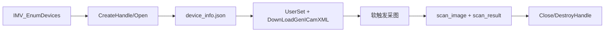

# IMV Scanner Calibration Tool

工厂标定数据采集工具，基于 **华睿 IMV MVSDK** 连接扫码器/工业相机，导出配置、软触发采图，并保存设备信息与结果文件。

## 功能概述

一次完整采集会依次完成：

1. 通过 **IMV SDK** 枚举并连接指定设备（序列号或 IP）
2. 保存 `device_info.json`（型号、SN、IP、MAC 等）
3. 导出 `software_config.xml` 与 `hardware_config.xml`（`IMV_DownLoadGenICamXML`）
4. 软触发采集一帧，保存图像与 `scan_result.json`（解码状态、条码内容等）

可选：`--dump-features` 导出可读 GenICam 特征摘要，用于调试不同机型的特征名差异。

## 环境要求

| 项目 | 说明 |
|------|------|
| 操作系统 | **Windows / Linux**（MVSDK 不支持 macOS） |
| Python | 3.10+（建议 3.10 或 3.11） |
| 原生库 | `MVSDKmd.dll`（Windows）或 `libMVSDK.so`（Linux） |
| 网络 | GigE 设备与 PC 在同一网段（使用 `--ip` 时） |

### 安装 MVSDK 原生库

**Windows（推荐）**：将厂商 SDK 包中 `Runtime/x64/` 下的文件复制到本项目同名目录：

```text
easyid-calibration-tool/Runtime/x64/MVSDKmd.dll
```

主库 `MVSDKmd.dll` 还需同目录下的 `GenApi_MD_VC120_v3_0.dll`、`ImageConvert.dll` 等约 10 个依赖 DLL（见 [`Runtime/x64/README.md`](Runtime/x64/README.md)）。请从安装包复制 **整个** `Runtime/x64` 目录。

在 Windows 上可先运行诊断：

```bat
python scripts\check_mvsdk_runtime.py
```

也可设置环境变量 `IMV_SDK_LIB` 指向 `MVSDKmd.dll` 的绝对路径（优先级更高）。

Windows 下通过 `kernel32.LoadLibraryW` 加载，并自动将 `Runtime/x64` 加入 DLL 搜索路径。

| 平台 | 默认搜索路径 |
|------|----------------|
| Windows x64 | [`Runtime/x64/MVSDKmd.dll`](Runtime/x64/MVSDKmd.dll) |
| Linux | `lib/libMVSDK.so` |

详细说明见 [`SDKPython/sdk.pdf`](SDKPython/sdk.pdf)。

```bash
# 示例（Linux）
export IMV_SDK_LIB=/opt/MVSdk/lib/libMVSDK.so
```

## 安装依赖

```bash
pip install -r requirements.txt
```

`Pillow` 用于在 SDK 存图失败时将 Mono8 保存为 PNG；JPEG 帧通常由 `IMV_SaveImageToFile` 直接保存为 `.jpg`。

## 使用方法

### 基本命令

通过**序列号**连接：

```bash
python read_scanner_calibration.py --sn <扫码器序列号>
```

通过 **IP 地址**连接：

```bash
python read_scanner_calibration.py --ip 192.168.1.100
```

仅列举当前可发现设备：

```bash
python read_scanner_calibration.py --list-devices
```

### 双网卡场景

1. 列举设备，确认 `interface_name` 或本机 IP：

```bash
python read_scanner_calibration.py --list-devices
```

2. 采集时指定网卡（接口名子串或本机 IPv4 子串）：

```bash
python read_scanner_calibration.py --ip 192.168.1.100 --interface "192.168.1"
```

### 常用参数

| 参数 | 默认值 | 说明 |
|------|--------|------|
| `--list-devices` | 关闭 | IMV 枚举设备并打印列表后退出 |
| `--interface` | 空 | 按设备 `interface_name` 或本机 IP 过滤 |
| `--output` | `./calibration_out` | 输出根目录；每次运行新建带时间戳子目录 |
| `--timeout-ms` | `2000` | `IMV_GetFrame` 超时（毫秒） |
| `--buffer-count` | `3` | `IMV_SetBufferCount` |
| `--no-clear-buffer` | 关闭 | 触发前不清空帧缓冲 |
| `--dump-features` | 关闭 | 额外导出 `feature_dump.json` |
| `--diag` | 关闭 | 打印 SDK 版本与枚举数量 |
| `--debug` | 关闭 | 详细日志 |

## 输出目录结构

```text
<序列号或IP>_<YYYYMMDD_HHMMSS>/
├── device_info.json
├── software_config.xml
├── hardware_config.xml
├── scan_image.jpg          # 或 .png / .raw
├── scan_result.json
└── feature_dump.json       # 仅 --dump-features
```

### `scan_result.json` 主要字段

- `read_state` / `read_state_name`：读码状态
- `code_num`：识别到的码数量
- `codes[]`：条码列表
- `image_path`：图像路径
- `width` / `height` / `is_jpeg`：图像信息

## 工作流程



软触发步骤（`scanner/capture.py`）：

1. `IMV_SetBufferCount`
2. `IMV_StartGrabbing`
3. 可选 `IMV_ClearFrameBuffer` 或排空 `GetFrame`
4. 设置 TriggerMode / TriggerSource / TriggerSelector
5. `IMV_ExecuteCommandFeature(TriggerSoftware)`
6. `IMV_GetFrame` → `IMV_SaveImageToFile` 或回退存图
7. `IMV_ReleaseFrame` → `IMV_StopGrabbing`

## 退出码

| 码 | 含义 |
|----|------|
| `0` | 采集成功 |
| `1` | 失败（未找到设备、SDK 错误、超时等） |

## 项目结构

```text
easyid-calibration-tool/
├── read_scanner_calibration.py   # CLI 入口
├── scanner_reader.py             # 采集流程编排
├── scanner/                      # IMV 业务模块
├── imv_sdk/                      # MVSDK Python 封装
├── Runtime/x64/                  # MVSDKmd.dll（Windows x64）
├── scanner_config.py             # GenICam 特征名候选
├── scanner_utils.py
├── SDKPython/                    # 厂商示例与 sdk.pdf（参考）
└── requirements.txt
```

## 常见问题

**`IMV SDK library not found`**

安装 MVSDK 原生库并设置 `IMV_SDK_LIB`，参见上文与 `SDKPython/sdk.pdf`。

**`No scanner device found`**

检查网线、IP、防火墙；使用 `--list-devices` 与 `--diag`。

**采图为空或超时**

增大 `--timeout-ms`；确认标定码在视野内；检查 `--interface` 是否指向正确网卡。
